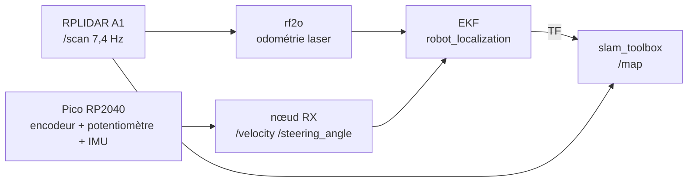
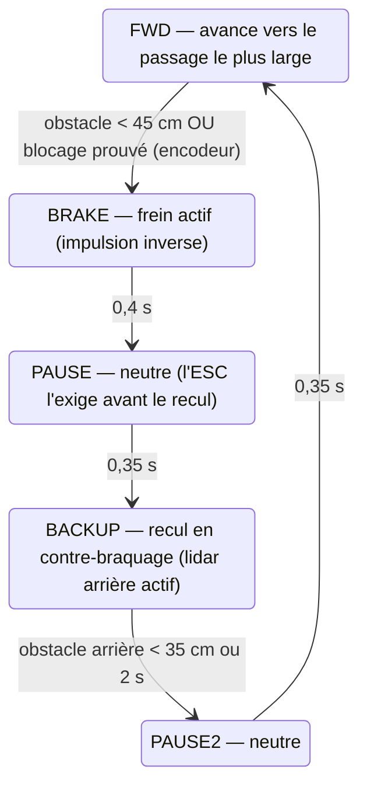

# 📅 Rapport hebdomadaire — ProtoVA1 remise en service · Démo 5G ProtoVA2 rétablie

**Douae Sebti — PFE ALTEN Labs (ProtoVA) · Semaine du 3 au 6 août 2026**

## 🎯 Objectif de la semaine

Rendre **ProtoVA1** (Jetson Nano, ROS 2 Foxy) de nouveau **pleinement téléopérable** au volant Logitech G29 avec retour de force, en intégrant le nouvel encodeur avec son étage de filtrage — première étape vers la démonstration finale : **deux plateformes opérationnelles échangeant des messages V2V (DENM)**.

**✅ Objectif atteint : la voiture a roulé au sol, téléopérée au G29 avec retour de force.**

## 🔗 Architecture mise en place

```
G29 + retour de force (PC)
   → joy_node → pont UDP /joy (maison)
      → Jetson Nano : g29_teleop → twist_mux → nœud TX (série USB)
         → Raspberry Pi Pico (FreeRTOS) → servo de direction + ESC moteur
         ← TICKS encodeur (40/tour) → topic /velocity
```

## ✅ Travaux réalisés

### 1. Firmware Raspberry Pi Pico (réécrit, compilé, flashé)
- **FreeRTOS**, 3 tâches : réception série (`CTRL,angle,vitesse`), contrôle servo+ESC, encodeur (`TICKS,n` à 50 Hz)
- **Recalibration du neutre ESC : 1400 → 1500 µs** — bug critique, à 1400 µs la voiture partait en marche arrière rapide sur la commande « stop »
- **Armement ESC automatique** : le signal neutre est désormais émis dès la mise sous tension (avant : il fallait débrancher/rebrancher l'alimentation à chaque session, le firmware attendait l'ouverture du port série avant de sortir le moindre signal)

### 2. Encodeur KY-040 + conditionnement du signal
- Chaîne validée : encodeur → filtre RC → trigger de Schmitt **74HC14** → Pico (élimination des rebonds mécaniques)
- Étude des décodages possibles (×1 = 20, ×2 = 40, ×4 = 80 ticks/tour) → **décodage ×2 retenu : 40 ticks/tour**
- Paramètres d'odométrie mis en cohérence côté ROS (`ticks_per_rev = 40` dans TX et ackermann_odom)

### 3. Réseau : pont UDP /joy
- Diagnostic : le partage de connexion utilisé **bloque les données DDS** entre machines (la découverte passe, les données non) — vérifié objectivement (UDP brut OK dans les deux sens)
- Développement d'un **pont UDP unicast** dédié : le PC envoie /joy en texte sur le port 9001, la Jetson le republie localement → interopérabilité Humble (PC) ↔ Foxy (Jetson) rétablie

### 4. Pile logicielle Jetson
- `twist_mux` installé et configuré (priorités : AEB 255 > PS4 60 > G29 30) — prêt pour l'arrivée d'un freinage d'urgence coopératif
- Script de lancement unique (`launch_teleop_p1.sh`) + service systemd `p1teleop` (résilient aux coupures SSH)
- Runbook complet documenté (flash → armement → 4 terminaux → conduite → diagnostic)

### 5. Premier roulage au sol et itération de réglages
Constats du premier essai → corrections immédiates :

| Constat | Cause | Correction |
|---|---|---|
| Retards à l'accélération | Consigne minimale dans la zone morte de l'ESC | Minimum relevé au-dessus de la zone morte |
| Vitesse bridée | Pédale à fond = 20 % de puissance seulement | Plage élargie à 35 % (ajustable) |
| Manque de précision | Course de pédale écrasée sur une plage étroite | Plage élargie → meilleure résolution |
| ESC à réarmer en débranchant | Firmware muet avant ouverture du port série | Neutre émis dès la mise sous tension |

## 📡 ProtoVA2 — Remise en route de la démo de téléopération 5G

La démo 5G (téléop G29 sur ROS 2 via **Zenoh**, PC hub ↔ véhicule en 172.16.48.7/6) était inopérante depuis le reflash de la Jetson Orin. Diagnostic et remise en route complète le 6 août :

### 🎯 Cause racine : la mémoire partagée (SHM) de Zenoh
Les nœuds ROS du véhicule mouraient **tous** à l'initialisation (`Failed to create POSIX SHM provider, OS error 12`) alors que le routeur Zenoh survivait — d'où l'impression trompeuse d'un lien « cassé ». En cause : le paquet `rmw_zenoh_cpp` réinstallé après le reflash (build plus récent que celui du PC) tente d'allouer un segment de **mémoire partagée** au démarrage de chaque nœud et échoue, alors que la mémoire était suffisante (3,8 Go libres).

**Correctif** : désactivation de la SHM dans la config de session Zenoh du véhicule :
```json5
transport: { shared_memory: { enabled: false } }   // zenoh_session_car.json5
```
Sans perte fonctionnelle : la SHM n'optimise que les échanges *intra*-machine, inutile pour un lien 5G.

### 🔧 Remises d'aplomb annexes
- Adresse fantôme **/30** du DHCP purgée côté véhicule (re-passage en /28 — piège récurrent)
- Route par défaut 5G supprimée côté PC (l'internet repassait par le lien cellulaire)
- Service `car5g` réactivé au démarrage

### ✅ Validation de bout en bout
- Topics du véhicule visibles du PC **à travers la 5G** ; `/joy` (volant) PC → véhicule à ~16 Hz ; `/cmd_vel` produit à bord → Pico
- Dashboard de latence en direct à travers le lien : http://172.16.48.6:8088
- Retour caméra dans `rqt` via le flux **compressé** (obligatoire : le 720p brut ≈ 600 Mbps > capacité montante 5G ≈ 70 Mbps ; en JPEG compressé, 30 im/s sans problème)
- Runbook 5G complet documenté (lancement en 2 terminaux + arbre de diagnostic)

## 🤖 ProtoVA2 — Cartographie SLAM en direct + exploration autonome

Travail réalisé sur **ProtoVA2** (Jetson Orin, ROS 2 Humble, WiFi FastDDS) : le véhicule **cartographie son environnement en temps réel tout en se conduisant seul** — il avance vers les passages libres, freine, recule en braquant pour se dégager et repart ailleurs, comme un conducteur réel.

### Chaîne de localisation (validée par la mesure)



| Vérification | Mesure | Verdict |
|---|---|---|
| Cadence lidar `/scan` | 7,4 Hz | ✅ nominale |
| Sortie EKF `/odometry/filtered` | 7,7 Hz | ✅ fonctionnelle (30 Hz configurés, à optimiser) |
| **Dérive à l'arrêt (20 s)** | **2,6 mm, 0°** | ✅ pas de biais capteur |
| Arbre TF `map→odom→base_link` | complet | ✅ cohérent |

### Visualisation en direct (contournement d'un bug RViz)
Le rendu de la carte dans RViz 2 souffre d'un bug de shader connu (carte jaune uni à chaque mise à jour). Solution : **visualiseur web dédié** (`map_live.py`) — s'abonne à `/map` + TF, dessine la carte en PNG avec la pose du véhicule, servie sur `http://localhost:8090` (rafraîchissement 1 s). RViz reste utilisé pour le nuage lidar, la TF et l'odométrie.

### Exploration autonome : machine à états « follow-the-gap » (`roamer.py`)



Points clés :
- **Préférence à l'avant** : recul en dernier recours seulement — obstacle réellement proche, ou *blocage prouvé* : gaz commandé mais encodeur immobile 2 s (**proprioception** — robuste aux obstacles invisibles du lidar, moquette, batterie faible)
- **Sécurité en couches** (twist_mux) : roamer priorité **10** < volant G29 **30** < AEB **255** ; + `stop_all.sh` = arrêt d'urgence (kill global **et** neutre envoyé à la Pico, qui mémorise la dernière commande)
- La séquence frein → neutre → recul reproduit le « double appui » exigé par l'ESC pour enclencher la marche arrière

### Anomalies débusquées pendant l'intégration

| Anomalie | Correction |
|---|---|
| **RX crashait au démarrage** depuis le reflash (`np.float` supprimé du numpy récent, utilisé par le vieux `transforms3d`) → véhicule *aveugle sur son propre corps* → fausses détections de blocage en boucle | `transforms3d` mis à jour (0.4.2) → `/velocity` et `/steering_angle` publient à nouveau |
| **Deux piles de conduite en double** → deux écrivains sur le port série de la Pico → commandes entremêlées, servo inerte | Nettoyage + règle « une seule pile à la fois » |
| **La Pico mémorise la dernière commande** : si le logiciel meurt en roulant, le véhicule continue indéfiniment | `stop_all.sh` ; correctif définitif planifié : **watchdog firmware** (neutre auto après 0,5 s sans commande) |
| Consignes de gaz sous le seuil de roulement (batterie faible) → le logiciel « croit » avancer | Vitesses relevées + détection de blocage par encodeur |

## 📦 Livrables (dépôt GitHub `protova2`)
- `protova1/pico_car_freertos.ino` — firmware final
- `protova1/joy_udp_bridge_tx.py` / `joy_udp_bridge_rx.py` — pont /joy
- `protova1/launch_teleop_p1.sh` — pile complète
- `docs/protova1_teleop_runbook.md` — procédure reproductible de A à Z
- `docs/demo5g_runbook.md` — runbook de la démo 5G (à jour du correctif SHM)

## 📋 Prochaine étape : ProtoVA2, puis la démo à deux véhicules
1. **ProtoVA2** : investiguer le bug « avance sans accélérateur » (boîte noire), calibrations
2. Émission **DENM au freinage AEB** côté ProtoVA2 (Vanetza déjà opérationnel)
3. Portage V2V sur ProtoVA1 (compilation Vanetza sur le Nano + nœud CAM/DENM léger)
4. **Démo finale** : ProtoVA2 freine (AEB) → DENM → ProtoVA1 réagit — sécurité coopérative entre deux véhicules réels
